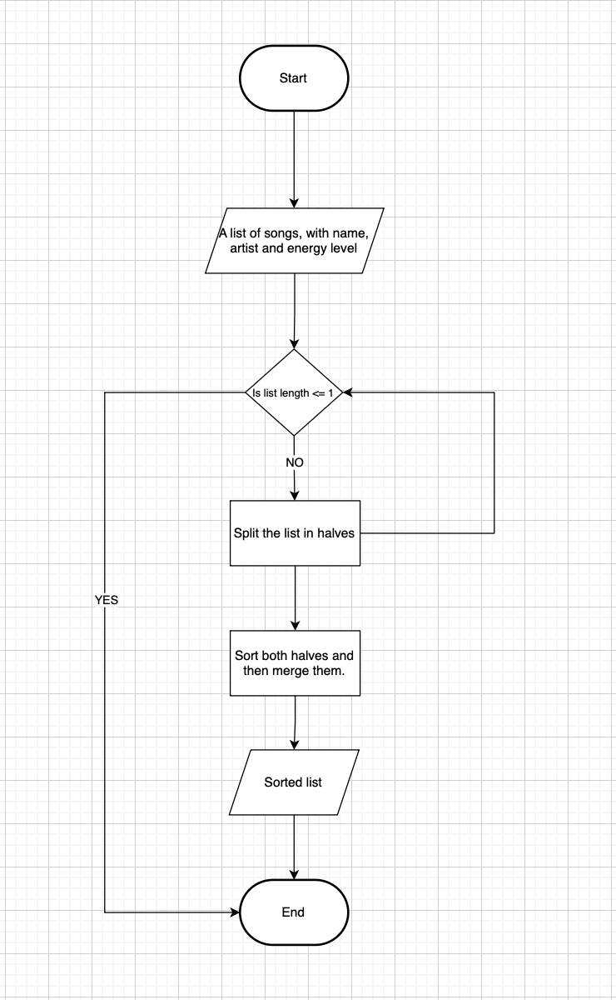

# Playlist Vibe Builder

## Chosen Problem:
I chose the playlist vibe builder because I find it interesting to explore how it works when paired with an appropriate algorithm.

## Chosen Algorithm:
I chose merge sort for the playlist vibe builder because this algorithm creates a copy of the original unsorted list, allowing the user to preserve the initial order while also having a new sorted version. Then the user could also rearrange the playlist in different ways without losing the original order. Additionally, since merge sort uses the divide and conquer strategy, it is highly efficient to sort the playlist based on the energy of the song or even the duration.

## Demo:

## Problem Breakdwon & Computational Thinking:
### Decomposition:
- We receive a unsorted list of songs with a specific energy score from 0 to 100
- We split until we have only one element per sub-list
- We compare and start to sort the list based on the energy score
- We merge the list in a copy of the original list
- We receive a sorted list

### Pattern Recognition:
The Merge sort algorithm follows a pattern where we divide the list into smaller sublists. Then we compare the first element of the left sublist with the first element of the right sublist, then the sublists are combined in the correct order. This splitting and merging pattern repeats until the list is fully sorted.

### Abstraction:
We show the user the final sorted list and a visualization of the merging process. We hide the recursion process process, since the interest of the user is just the output.

### Algorithm Design:
- **Input:** A list of unsorted songs given to gradio.
- **Process:** Use merge sort algorithm to organize the songs based on their energy level into a new list.
- **Output:** A visualization of the merging process, and the new final sorted list.

**Note:** I chose to use a Python list because the merging process is easier to implement compared to a linked list.

### Flowchart:

